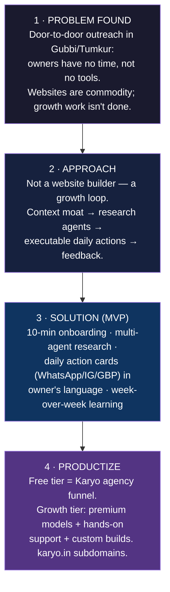

# Graphify — Karyo Growth Engine (TakeOver'26)

**One-liner:** Karyo is an AI growth head for Indian local businesses — it researches your market, plans your week, writes every post in your language, and learns from what worked.

This repo is the single source of truth. **Read `CLAUDE.md` and `docs/context.md` before writing any code or prompting any AI agent.** Every AI session (Claude Code, Antigravity, anything) must start with this context loaded — that is what prevents duplicate or wrong generations across three people.

## The journey (judge-facing graph)



A living, more detailed version (with decision nodes added as we build) is in [`docs/journey.md`](docs/journey.md). Keep it updated — it is the backbone of the judge pitch.

## Team

| Who | Owns | Branch prefix |
|---|---|---|
| Karan |  | `karan/` |
| Havinash |  | `hav/` |
| Saagnik |  | `saag/` |

Task ownership lives in [`docs/tasks.md`](docs/tasks.md). Claim before you build. Never two people (or two AI sessions) on the same task.

## Quickstart

```bash
git clone <repo-url> && cd graphify
cp .env.example .env.local        # fill in your own free-tier keys
npx create-next-app@latest app --ts --tailwind --app --src-dir --import-alias "@/*"
```

Then open Claude Code **in the repo root** (not in `/app`) so `CLAUDE.md` auto-loads.

## The rule that keeps three people sane

After every meaningful change: append one line to `docs/decisions.md` (what + why), tick your task in `docs/tasks.md`, push. Before every session: pull, read the last 10 lines of `docs/decisions.md`. That 60-second ritual is the whole context system.
